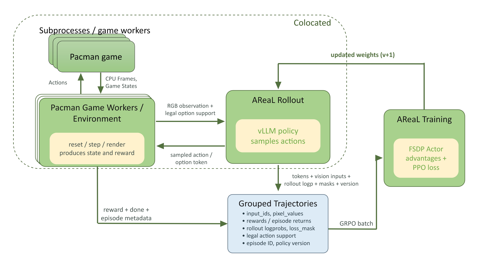
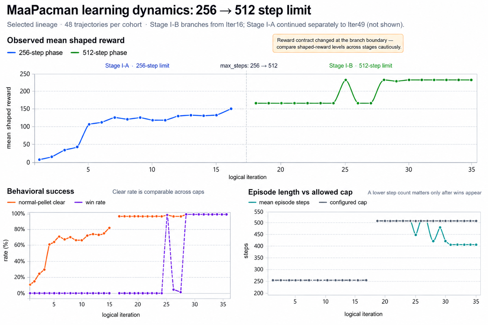
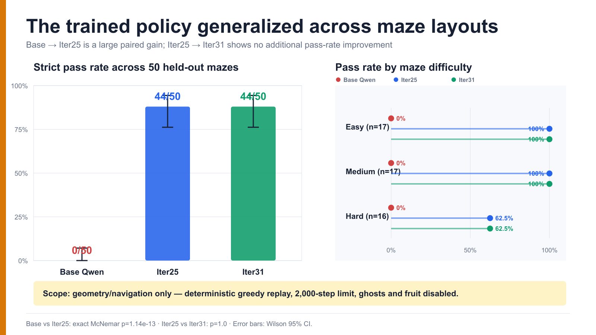

<h1 align="center">
Building a Pacman Game Agent with <em>AReaL</em>
</h1>

<p align="center"><em>From a vision-language model to a long-horizon game agent</em></p>

This post explores a practical question: how can we train a vision-language model (VLM)
to become an interactive agent that acts coherently over an entire game, rather than
answering a single static prompt? We study this question through Pacman.
[MaaPacman](https://codehub-dg-g.huawei.com/AgenticRLGaming/MaaPacman) provides the
controlled game environment and interaction adapters, while AReaL provides the rollout
and distributed reinforcement-learning infrastructure.

The model repeatedly observes the game, selects an action available in the current
state, and learns from consequences that unfold across a complete game trajectory. Our
goal is not simply to maximize a Pacman score, but to understand the task definition,
feedback design, and systems support needed to train long-horizon visual agents
reliably.

## 1. Motivation: Why Games, and Why Start with Pacman?

Games provide a natural playground for studying these agents. They retain the central
difficulty of long-horizon interaction—each action changes future observations and
outcomes—while providing explicit rules, measurable results, and resettable
environments. Games therefore occupy a useful middle ground: they are more interactive
than static benchmarks, but more controllable and repeatable than the physical world.

This role of games as an AI testbed is well established. The
[Arcade Learning Environment](https://arxiv.org/abs/1207.4708) introduced Atari games as
a common platform for evaluating general agents. More recent work has expanded the
setting: Google DeepMind's
[SIMA](https://deepmind.google/blog/sima-generalist-ai-agent-for-3d-virtual-environments/)
maps screen images and language instructions to keyboard and mouse actions across
multiple 3D games, while OpenAI's [Video PreTraining](https://openai.com/index/vpt/)
learns Minecraft behavior from gameplay videos and is fine-tuned for tasks requiring
long sequences of actions. Microsoft Research's
[Muse](https://www.microsoft.com/en-us/research/blog/introducing-muse-our-first-generative-ai-model-designed-for-gameplay-ideation/)
takes a different direction by learning game dynamics from visual frames and controller
actions for gameplay generation and ideation. These projects do not solve the same
problem, but together they show why games are a useful laboratory for models that
perceive, predict, and act.

Pacman is an intentionally compact starting point. Its visual scene and action mechanics
are far smaller than those of Minecraft or a modern 3D game, which makes rollout,
training, and diagnosis more affordable. Yet completing a maze can still require
hundreds of dependent decisions: each move changes the next observation and the
currently available choices, while the final outcome may depend on decisions made much
earlier.

Its compactness also lets us build an inspectable experimental environment. We can reset
episodes reproducibly, capture visual observations, validate state-dependent actions,
record structured events, replay failures, and create new maze variants. Pacman is
therefore not the final destination, but a controlled bridge from a static VLM to a
long-horizon visual agent.

## 2. Problem Definition

How can we train a vision-language model (VLM) to perceive, decide, and act in a
long-horizon game through a sequence of grounded decisions?

Unlike a static vision-language task, Pacman requires a closed interaction loop. Each
model output changes the environment and therefore determines the next observation, the
next set of available actions, and the agent's eventual outcome. One game may contain
hundreds of such dependent decisions.

### 2.1 Two policy settings

We study two policy settings that differ in the action abstraction assigned to the
model: a **primitive-action policy** and a **harness-mediated option policy**. In our
experimental curriculum, Stage I pairs the primitive-action policy with a ghost-free
environment, while Stage II pairs the harness-mediated option policy with ghost-enabled
play. These stage labels describe the capability curriculum, not Pacman's numbered game
levels. The staged design first isolates visual maze grounding and local navigation,
then introduces dynamic hazards and higher-level objectives.

To keep the action terminology precise, we use **global action vocabulary** `V` for a
fixed set of action identifiers, each represented by one output token, and
**state-dependent admissible-action set** `A(s_t) ⊆ V` for the identifiers permitted at
decision `t` by the environment or deterministic option harness. Constrained decoding
restricts sampling to `A(s_t)`; we reserve **policy support** for the
probability-theoretic set of actions assigned nonzero probability after the decoding
rule is applied, rather than use it as another name for the admissible-action set.
Throughout this post, the action vocabulary is fixed; the admissible-action set is what
changes. For the primitive-action policy, `V` contains four direction identifiers. For
the harness-mediated option policy, it is a fixed, bounded vocabulary of high-level
option identifiers. In both cases, the policy must sample from the current `A(s_t)`
rather than the full action vocabulary.

| Setting                            | Model output                                             | Admissible-action set at one decision                       | Execution unit                                     | Stage in this study      |
| ---------------------------------- | -------------------------------------------------------- | ----------------------------------------------------------- | -------------------------------------------------- | ------------------------ |
| **Primitive-action policy**        | One primitive-action identifier                          | Identifiers for directions open in the current state        | One primitive environment step                     | Stage I · ghost-free     |
| **Harness-mediated option policy** | One identifier for a harness-generated high-level option | Identifiers for the options advertised in the current state | A bounded, revalidated sequence of primitive steps | Stage II · ghost-enabled |

In the primitive-action policy, one model decision directly controls one game step.
Constrained decoding removes directions that are blocked in the current state, but the
model remains responsible for selecting the next low-level move.

In the harness-mediated option policy, a deterministic option harness instantiates a
small set of harness-generated high-level options from predefined strategy families:
collect pellets, avoid danger, or pursue an edible ghost. Only the strategy families are
predefined; each option's concrete target, route, and availability are recomputed from
the current game state. We refer to each resulting choice as a **harness-generated
high-level option**. Only identifiers for the currently advertised options enter
`A(s_t)`.

After the model selects an advertised option, the option harness executes its primitive
moves and checks after every step whether the option has completed or become invalid.
This temporal action abstraction shifts the learned decision from **which direction
should Pacman move next?** to **which high-level objective should Pacman pursue next?**
Low-level route construction and safety validation remain deterministic parts of the
option harness.

Across both settings, the task requires:

1. **Visual grounding:** extract task-relevant information from the current game screen.
1. **Closed-loop decision-making:** adapt each decision to the state produced by
   previous actions.
1. **State-dependent action admissibility:** select only an identifier in `A(s_t)`. In
   the harness-mediated option policy, both this admissible-action set and each
   advertised option's grounded target may change between decisions.
1. **Long-horizon decision-making:** account for consequences that may appear many
   decisions later.
1. **Generalization:** transfer the learned policy to unseen game states and maze
   layouts rather than memorize one trajectory.

## 3. Challenges

### 3.1 Sparse reward cannot bootstrap missing perception and planning

Our earliest probes asked whether the base VLM could first recover the game state from
pixels. On three real live-demo frames, it identified Pacman's exact row and column in
`0/3` cases, recovered the complete `OPEN` and `BLOCKED` direction sets in `0/3`, and
produced a valid 25-by-21 ASCII maze in `0/3`. Its mean absolute error when counting the
remaining pellets was 48. The model could recognize the scene as Pacman while still
failing to ground the state needed for control.

This creates a cold-start problem for reinforcement learning. In an early strict
image-only, no-training pilot, none of 32 rollouts completed the maze. Every episode ran
to the step limit and produced the same negative episode return. With no within-group
return variation, group-relative normalization would assign zero advantage to every
sample and provide no policy-gradient signal. Increasing the rollout horizon cannot
repair missing visual grounding or planning; it may only make the same uninformative
trajectories longer and more expensive.

The seed-0 replay below gives a qualitative view of the resulting control failure. The
original, untrained Qwen3.5-9B policy makes little useful progress and eventually
terminates as `STUCK`. The replay illustrates the behavioral consequence of weak visual
grounding and planning; it does not by itself isolate which component caused each bad
decision.

<video src="https://github.com/user-attachments/assets/2745b846-65d1-47a2-be22-8b79ee217ca1" controls width="100%" poster="../assets/demos/pacman-base-seed0-poster.png"></video>

[Download the versioned base-model MP4](../assets/demos/pacman-base-seed0.mp4)

This cold-start barrier motivates a curriculum-learning-like progression: introduce
visual grounding, local action selection, and longer-horizon planning in stages rather
than demand full-game competence from the initial policy.

### 3.2 Long feedback cycles and GPU memory requirements

Consider an experimental run with 49 optimizer updates, each requiring 48 rollout
episodes. From the first rollout of Iter1 to the last rollout of Iter49, the end-to-end
process—including the optimizer updates performed between rollout batches—took 46.21
hours.

If the architecture or experimental design contains a subtle bug, the learning curve may
not reveal it for many hours, by which point substantial compute has already been spent.

The experiments also have substantial GPU memory requirements. The vLLM rollout engine,
FSDP actor, and optional reference model share the available compute and memory on the
same 8-GPU node. Long rollout episodes also increase trajectory-storage and
log-probability costs. Model offloading, memory-aware batching, distributed trajectory
processing, and checkpoint retention are therefore part of the training design, not
optional infrastructure polish.

### 3.3 Mismatched action constraints mis-specify PPO ratios

At decision `t`, let `A_t = A(s_t) ⊆ V` be the recorded state-dependent
admissible-action set. Constrained decoding makes the vLLM rollout distribution a
behavior policy `π_behav` renormalized over `A_t`.
[AReaL's decoupled PPO objective](https://arxiv.org/abs/2505.24298) distinguishes that
behavior policy from the pre-update proximal policy `π_prox` and the current actor
policy `π_θ`. It uses a behavior correction and a
[clipped PPO probability ratio](https://arxiv.org/abs/1707.06347):

```math
w_t = \frac{\pi_{\mathrm{prox}}(a_t \mid s_t,A_t)}
           {\pi_{\mathrm{behav}}(a_t \mid s_t,A_t)},
\qquad
r_t(\theta) = \frac{\pi_\theta(a_t \mid s_t,A_t)}
                   {\pi_{\mathrm{prox}}(a_t \mid s_t,A_t)}.
```

Every probability in these ratios must use the same `A_t` and temperature. If rollout
sampling is normalized over `A_t` but the FSDP actor computes `π_prox` over the full
vocabulary `V`, the behavior correction instead contains

```math
\widetilde{w}_t
= \frac{\pi_{\mathrm{prox}}(a_t \mid s_t,V)}
       {\pi_{\mathrm{behav}}(a_t \mid s_t,A_t)}
= \frac{Z_{A_t}}{Z_V} \neq 1
\quad\text{when the model parameters match}.
```

This is a normalization error, not policy staleness. It creates spurious importance
weights, can reject or clip valid samples, and sends gradient into inadmissible logits.
The rollout can remain legal and the loss finite while the surrogate gradient no longer
represents the constrained policy that generated the data.

[Huang and Ontañón](https://arxiv.org/abs/2006.14171) call the analogous combination of
masked sampling and unmasked policy-gradient evaluation **naive invalid action
masking**. Their PPO experiments produced much larger KL divergence and more variable
convergence than consistent masking. A related operational failure appeared in a
separate 512-step diagnostic continuation. Behavior–proximal likelihood drift exceeded
the configured alignment gate, so an attempted update failed closed before advantage
computation and PPO. This observation shows that rollout–training probability
disagreement can halt learning; it does not identify mismatched action constraints as
the sole cause.

The exact token IDs for `A_t`, the sampled token, rollout temperature, and behavior
log-probability must therefore travel together through distributed batching. Section 4.3
describes how the FSDP actor and, for KL regularization, the reference policy reuse that
recorded constraint.

### 3.4 Credit assignment has two axes: timescale and episode weight

Long-horizon learning raises two related but distinct questions: what learning signal
should each decision receive, and how much total optimization weight should each episode
receive?

Episode-level GRPO preserves an episode-level shaped objective: intermediate step
rewards are summed over the rollout episode before returns from the same initial prompt
are normalized. GRPO therefore does not ignore intermediate rewards. The loss of
information happens afterward: the same normalized episode-return task signal is
assigned to every model decision in that episode. A useful move, a bad detour, and the
action preceding death all receive the same coarse credit.

An immediate step reward or option-span return offers finer temporal feedback, but its
limitation is the opposite: it is local. By itself, it neither propagates consequences
that arrive after the scored span nor compares the selected action with alternatives. An
immediate pellet gain may lead into a dead end, while safe repositioning may pay off
only much later. Without a state-conditioned or counterfactual baseline, such a return
is local feedback, not a true local advantage. Episode-level GRPO and intermediate
rewards are therefore not alternatives; the challenge is to combine long-horizon
alignment with useful local credit.

Episode weighting is a separate issue. A flat mean over trained tokens gives a longer
trajectory more total gradient weight merely because it contains more model decisions.
The distributed pipeline must preserve episode boundaries so it can average within each
episode before averaging across episodes, while still balancing the actual token load:

```text
initial prompt / maze
└── environment rollout episode
    └── model decision (primitive action or harness-generated high-level option)
        └── output token
```

## 4. Method

### 4.1 System architecture: MaaPacman as the RL environment adapter

The simplest way to read Figure 1 is from left to right. MaaPacman's environment layer
sits between the RL workflow and concrete Pacman game instances. Toward the workflow, it
exposes a Gym-style interface: `reset(seed)` starts an episode, `step(action)` returns
the next RGB observation, base reward, termination or truncation flags, and structured
game metadata, and `render()` exposes the current frame. Toward the game, each
environment object manages an isolated `pacman-python` game instance. The workflow
therefore sees a stable environment interface rather than game-process details.



*Figure 1. Each MaaPacman environment object presents a Gym-style interface to the RL
workflow and delegates actions to an isolated Pacman game instance. The rollout policy
selects actions; the FSDP actor learns from grouped trajectories and never controls the
game directly.*

During rollout, the workflow sends the RGB observation and current state-dependent
admissible-action set to the policy. Under the harness-mediated option policy, it also
sends metadata describing each advertised option. The policy returns an action
identifier; the environment or option harness resolves it to the corresponding primitive
action or grounded option. The figure uses the legacy label “legal option support”; in
this post, that label denotes `A(s_t)`, not policy support. The environment returns game
events and terminal state; the `areal-pacman` workflow applies the experiment-specific
reward function and assembles the interaction records into grouped trajectories. AReaL
trains on those trajectories and publishes updated weights back to the rollout policy.

This conceptual split maps to the repositories as follows:

| Repository      | Responsibility                                                                                                                                    | Deliberate boundary                                       |
| --------------- | ------------------------------------------------------------------------------------------------------------------------------------------------- | --------------------------------------------------------- |
| `pacman-python` | Concrete game instances: Pygame transitions, RGB frames, structured state, and terminal events                                                    | Game semantics only; no RL interface                      |
| `MaaPacman`     | Gym-style headless adapter, isolated game workers, and deterministic option harness                                                               | Environment interaction and planning; no distributed RL   |
| `areal-pacman`  | Environment-to-AReaL workflow, prompts, reward function, configuration, evaluation, and experiment records                                        | Experiment semantics; no generic FSDP/vLLM implementation |
| `AReaL`         | Asynchronous rollout, PPO/GRPO, vLLM, FSDP, checkpointing, distributed data movement, and our training-side constrained-log-probability extension | No game-environment or option-generation logic            |

This layout lets us test game events, reward semantics, and distributed policy updates
independently. It also prevents a common architecture error: drawing a direct control
edge from the training actor to the game.

### 4.2 Harness-mediated option policy: let the model choose intent

Under the harness-mediated option policy, the model selects a high-level intent rather
than an individual movement direction. At each decision point, the deterministic option
harness instantiates a bounded set of state-valid choices from three predefined strategy
families:

- **Collect pellets:** move toward an approved pellet target;
- **Avoid danger:** move toward a safe escape anchor;
- **Pursue an edible ghost:** approach a vulnerable ghost.

Each instantiated option includes a target, first primitive action, bounded commitment,
and safety metadata. The VLM selects one option identifier from the current
admissible-action set; it does not emit a precomputed action list. The deterministic
harness uses breadth-first search (BFS) over the maze topology and handcrafted safety
checks to ground that intent into primitive moves. `COLLECT`, `AVOID`, and `ELIMINATE`
options are capped at `min(8, d)`, `min(3, d)`, and `min(6, d)` steps, respectively,
where `d` is the current shortest-path distance. After every environment step, the
harness recomputes and revalidates the selected strategy and target, stopping on
completion, invalidation, episode termination or truncation, or the commitment cap. The
result is a bounded, revalidated action chunk rather than blind replay of a fixed route.

In a separate paired in-sample evaluation snapshot covering the same 60 episode IDs for
each of four evaluated policy versions—240 rollouts in total—37,459 fresh model
decisions controlled 55,975 primitive environment steps, or **1.49 steps per model
turn**. One trajectory row is one `env.step(action)`; a model turn is a row with
`model_called=true`. The ratio stays close to one because `COLLECT` accounted for 85.9%
of model turns and 86.6% of those chunks ended after one step. This is a descriptive
measurement of realized option granularity in that snapshot, not a universal constant or
a Stage II performance result.

This division of labor is intentional. The option harness owns deterministic legality
checks, route construction, and safety validation; the learned policy decides which
advertised harness-generated high-level option is most useful in the current visual
context. It reduces the number of model decisions without turning the policy into a
hand-coded Pacman solver.

### 4.3 Constraint alignment across rollout and training

For either policy setting, let `A(s)` be the state-dependent admissible-action set. At
the training temperature, with no additional nucleus truncation, the constrained policy
is the model distribution renormalized over that set:

```math
\pi_\theta(a \mid s, A(s))
= \frac{\exp(z_\theta(a,s)/T)}
{\sum_{a'\in A(s)} \exp(z_\theta(a',s)/T)},
\qquad a\in A(s).
```

At rollout time, the workflow maps the identifiers in `A(s)` to exact tokenizer IDs. A
small AReaL request adapter forwards them to vLLM's built-in `allowed_token_ids`, which
masks other tokens before sampling. The rollout engine records the constrained behavior
log-probability `log π_behav` after applying the token constraint and temperature.

The rollout stores the sampled token, temperature, behavior log-probability, and exact
admissible-action set together. Before an update, the FSDP actor recomputes the proximal
log-probability `log π_prox`; during the PPO forward pass, it evaluates the current
policy `log π_θ`. Neither operation decodes. Both renormalize the actor's logits over
the recorded `A(s)`. When KL regularization is enabled, the reference policy `π_ref`
uses the same set and temperature, although it is not a denominator of the PPO ratio.
These distributions need not be equal because their parameters or versions may differ;
their admissible-action set and normalization rule must match. If `|A(s)| = 1`, the
constrained probability is one and the log-probability is zero.

The key invariant is stronger than “apply an action mask”:

> Rollout behavior, proximal-actor, current-actor, and reference-policy
> log-probabilities—when enabled—must use the same recorded admissible-action set and
> temperature.

### 4.4 Reward design: learn from events, not raw score

The Stage I primitive-action configurations derived rewards from structured game events
emitted by the environment rather than the game's raw score. In the 256-step
configuration, a valid executed action at step $t$ received:

```math
\begin{aligned}
r_t ={}& n_t^{\text{pellet}}
+ n_t^{\text{power}}
+ 50\,\mathbb{1}[\text{level cleared}] \\
&- 0.05
- 0.5\,\mathbb{1}[\text{wall collision}]
+ r_t^{\text{progress}}.
\end{aligned}
```

Fruit remains observable but carries no direct training reward. To provide denser
feedback, we add a progress term based on the change in shortest-path distance to the
nearest normal pellet:

```math
r_t^{\text{progress}}
= 0.1\,c_t\,(d_{t}^{\text{before}}-d_{t}^{\text{after}}),
\qquad
c_t = 1-\rho_t,
\qquad
\rho_t=\frac{m_t}{m_0}.
```

Here, $m_t$ is the number of normal pellets remaining after step $t$, and $m_0$ is the
initial count. The progress term is omitted when the same step already collects a normal
pellet, avoiding double payment for one event. Scaling by $c_t$ makes the guidance
strongest late in the game, when only a few pellets remain. An invalid or unparsable
action response instead received `-50` for that model decision and ended the episode.

The 512-step primitive-action continuation that produced Iter25 and Iter31 kept the same
event-level reward family and fixed step cost, but used raw per-decision feedback
without reward or advantage normalization. Ghost, death, and safety-refusal terms belong
to ghost-enabled training configurations; they should not be read into the ghost-free
primitive-action results.

This shaped reward is a training signal, not the success criterion. Strict level
completion and held-out success remain the primary evaluation metrics.

### 4.5 From environment rewards to the policy objective

The reward function defines what feedback the environment produces; the objective
contract defines how that feedback is assigned, normalized, and reduced into an update.
These are separate design choices. We organize the implemented contracts into two
high-level families.

The **local-feedback family** assigns a decision the reward from its immediate
environment step, or, for a harness-generated high-level option, the sum over that
option's committed execution span:

```math
R^{\text{option}}_{e,j}
= \sum_{t\in\text{committed span}(e,j)} r_{e,t}.
```

In its raw variant, it applies neither reward normalization nor advantage normalization.
This gives dense, temporally local feedback, but it does not propagate consequences that
occur after the scored step or option ends. An option-span return is therefore a local
score, not a counterfactual or state-conditioned advantage.

The **episode-level group-relative family** first sums all shaped step rewards over one
rollout episode:

```math
R_e=\sum_t r_{e,t}.
```

Exactly 12 episodes sampled from the same initial prompt are normalized with the group
sample standard deviation:

```math
G_e=\frac{R_e-\mu_{\text{prompt}}}
{\sigma_{\text{prompt}}+10^{-5}}.
```

The same group-relative episode signal is assigned to the model decisions in that
episode. Intermediate rewards are not discarded: their temporal locations are lost when
they are aggregated into one episode return. Loss is then averaged within each rollout
episode before episodes are averaged:

```math
L=\frac{1}{|E|}\sum_{e\in E}
\left(\frac{1}{N_e}\sum_{t\in e}L_{e,t}\right).
```

Here, $N_e$ is the number of valid trained action tokens in rollout episode $e$. This
reduction prevents length alone from increasing an episode's intended weight: a
200-decision rollout's token losses and a 50-decision rollout's token losses are each
averaged within their own episode. The data pipeline preserves episode boundaries and
encoded admissible-action sets while balancing token load across workers.

The reported runs do not map to these families uniformly. Both Stage I phases used
local, per-decision shaped feedback, but the 256-step run additionally used the
then-current group reward normalization and batch advantage normalization. The later
512-step continuation used raw local feedback with both normalizations disabled. Neither
run used the whole-episode group-relative contract above. Among the reported
experiments, only the bounded ghost-enabled option-policy validation run exercised that
contract.

### 4.6 What AReaL provides, and what Pacman required

[AReaL](https://github.com/inclusionAI/AReaL) provides the distributed RL substrate:
asynchronous agent rollouts, PPO/GRPO optimization, inference and training workers,
checkpointing, generic multi-turn agent workflows, and multimodal rollout and training
support. Its reference examples expose the last two capabilities mostly separately: the
multi-turn example is a text-only GSM8K retry loop, whereas `VisionRLVRWorkflow`
performs a single image-conditioned generation per episode.

MaaPacman combines these capabilities in an interactive visual-control workflow. At each
fresh model decision, the environment renders the current game state and packages
exactly one fresh PNG with the prompt, while the native workflow preserves the
corresponding VLM processor outputs through rollout and training. Under the
harness-mediated option policy, one selected option may execute several primitive
environment steps before the next model call. The precise contract is therefore one
fresh image per model turn, not one image per environment step.

The integration also carries each state's admissible-action set from rollout into actor
and reference log-probability computation, keeping the constrained policy consistent
across generation and training. It preserves environment-episode identity through
distributed batching, enabling equal-episode loss weighting even when trajectories have
different lengths, and adds the operational support needed for long episodes,
variable-duration options, VLM memory pressure, checkpoint retention, and reproducible
experiment records.

Together, these changes make our AReaL-based stack capable of training a Pacman agent
with state-dependent admissible actions. The current interface remains Pacman-specific
rather than a generic constrained-agent API.

## 5. Experimental Results

### 5.1 Experimental blueprint

We followed a staged curriculum rather than train the full ghost-aware task from
scratch:

```text
Stage I-A: ghost-free primitive actions, 256-step cap
    → diagnose visual grounding and local navigation; select Iter16
Stage I-B: ghost-free primitive actions, 512-step cap
    → continue Iter16; select Iter25 and Iter31; test maze generalization
Stage II: ghost-enabled, harness-mediated option policy
    → transfer Iter25 in a rollout-only probe
    → run a bounded three-update whole-episode GRPO validation
```

Stage I-A isolates the first capabilities the agent needs: perceive the maze from the
current screenshot, choose a legal direction, and make locally reasonable progress
toward pellets without dynamic ghost hazards. The 256-step cap kept early diagnosis
bounded, but every completed training episode reached that cap; terminal evaluation was
therefore needed to distinguish a useful checkpoint from one with merely high shaped
reward. This evaluation selected Iter16 rather than the latest checkpoint.

Stage I-B resumed Iter16 with the same ghost-free primitive-action policy and raised the
cap to 512 steps, giving the policy more room to turn local navigation into full-maze
progress. This continuation produced Iter25 and Iter31, which were then evaluated across
held-out maze layouts. Stage II transferred Iter25 to the harness-mediated option policy
in a ghost-enabled environment. The task changed from choosing every direction to
choosing among harness-generated high-level options for collecting pellets, avoiding
danger, or pursuing an edible ghost. We first tested the transferred checkpoint without
training, then ran three bounded updates with the episode-level objective from Section
4.5. This final stage tests a harder action abstraction and environment; it is not part
of the Stage I learning curve.

### 5.2 Training dynamics and checkpoint selection

The training run used Qwen3.5-9B, a 256-step rollout cap, and single-token
primitive-direction actions constrained to the directions open in the current state. For
each prompt row, immediate decision rewards from 12 rollout episodes were flattened and
group-normalized; advantages were then normalized across the batch, and PPO was reduced
over trained action tokens. This run did not use the later whole-episode, equal-episode
contract in Section 4.5. All 48 episodes in every completed cohort reached the 256-step
cap, so they happened to contribute the same number of action tokens; this was still not
an equal-episode loss contract. Training used four prompt rows per update on one 8-GPU
node and sampled at temperature 0.7. Forty-nine optimizer updates completed; the next
cohort was rollout-only and is excluded.



*Figure 2. The selected lineage follows Stage I-A through Iter16 and then its Stage I-B
continuation; Stage I-A continued separately to Iter49, which is not fully plotted. Each
point aggregates a 48-episode cohort. Because both the horizon and feedback contract
changed at the branch, shaped-reward levels across phases are not directly comparable.
Clear rate remains comparable across caps; lower episode counts matter only after wins
appear.*

| Checkpoint      | Mean shaped reward in its training cohort | Greedy wins on seeds 0, 1, 2 | Mean normal-pellet clear rate |
| --------------- | ----------------------------------------: | ---------------------------: | ----------------------------: |
| Base Qwen3.5-9B |                                         — |                          0/3 |                          1.6% |
| Iter16          |                                 **150.7** |                      **3/3** |                    **100.0%** |
| Iter49          |                                     120.3 |                          0/3 |                         92.2% |

These three deterministic replays on one maze are a checkpoint-selection diagnostic, not
a success-rate estimate. The failure mode is nevertheless important: the latest model
cleared most pellets while failing the terminal task. Neither training reward nor
“percent cleared” should replace checkpoint evaluation on the actual terminal objective.

### 5.3 Generalization across 50 maze layouts

Iter25 and Iter31 came from the same later 512-step continuation of Iter16. We evaluated
them and the base model on a shared set of 50 held-out maze layouts with deterministic
greedy decoding and a 2,000-step limit. Iter16 itself was not run on this suite, so this
is a separate generalization study rather than a checkpoint curve spanning both Stage I
phases.



*Figure 3. Iter25 produced a large paired improvement over the base model. Continuing to
Iter31 did not improve the strict pass count.*

| Model           | Strict passes |   Wilson 95% CI | Mean normal pellets remaining |  Easy / medium / hard |
| --------------- | ------------: | --------------: | ----------------------------: | --------------------: |
| Base Qwen3.5-9B |          0/50 |       0.0%–7.1% |                        237.20 |    0/17 · 0/17 · 0/16 |
| Iter25          |     **44/50** | **76.2%–94.4%** |                          0.30 | 17/17 · 17/17 · 10/16 |
| Iter31          |     **44/50** | **76.2%–94.4%** |                      **0.24** | 17/17 · 17/17 · 10/16 |

Base→Iter25 is a paired gain of 88 percentage points (exact two-sided McNemar
`p=1.14e-13`). Iter25 and Iter31 have no discordant outcomes (McNemar `p=1.0`); both
fail the same six hardest maze variants.

The scope matters: this was a **geometry/navigation evaluation in safe mode, with ghosts
and fruit disabled**. It is strong evidence that the learned policy transfers across
maze layouts. It is not evidence of general ghost-aware Pacman play.

### 5.4 Transfer and bounded training with the ghost-enabled, harness-mediated option policy

We next loaded Iter25 into the Stage II harness-mediated option policy without
performing another PPO update. In one matched probe at seed 2 and temperature 0.7, each
model ran 12 episodes with a 512-step cap. Iter25 completed the normal-pellet objective
in `8/12` episodes, compared with `2/12` for the original Qwen3.5-9B model. Both
produced `12/12` unique option paths in this sample.

We then initialized both the actor and frozen KL reference from the immutable Iter25
checkpoint and created a fresh optimizer for a bounded three-update validation run. Each
update used four initial prompts and 12 rollout episodes per prompt, each capped at 512
steps, for 48 episodes per update. Full collected rollout-episode returns were
normalized only within each prompt group, the resulting episode signal was assigned to
that episode's option decisions, and each episode received equal intended loss weight.
All three optimizer updates completed and wrote regular model checkpoints.

The rollout probe shows that the Stage I checkpoint can operate with the ghost-enabled,
harness-mediated option policy without collapsing to one repeated option sequence. The
bounded three-update validation run shows that the whole-episode constrained-policy
training path executes end to end. It is still not a long Stage II learning curve, a
multi-seed improvement estimate, or evidence of general ghost avoidance. In particular,
normal-pellet completion should not be silently equated with every possible full-game
objective.

### 5.5 Qualitative trajectory demos

The compact MP4s below provide qualitative examples of the trajectories above. Each
GitHub-hosted player is followed by a link to the versioned MP4 in this repository.

#### Base model · seed 0

<video src="https://github.com/user-attachments/assets/2745b846-65d1-47a2-be22-8b79ee217ca1" controls width="100%" poster="../assets/demos/pacman-base-seed0-poster.png"></video>

[Download the versioned MP4](../assets/demos/pacman-base-seed0.mp4)

#### Iter16 · seed 0

<video src="https://github.com/user-attachments/assets/15a7c273-3133-4650-9cb1-4be81323fb00" controls width="100%" poster="../assets/demos/pacman-iter16-seed0-poster.png"></video>

[Download the versioned MP4](../assets/demos/pacman-iter16-seed0.mp4)

#### Iter49 · seed 0

<video src="https://github.com/user-attachments/assets/1160f967-c7bb-4426-b5e2-1834b3138018" controls width="100%" poster="../assets/demos/pacman-iter49-seed0-poster.png"></video>

[Download the versioned MP4](../assets/demos/pacman-iter49-seed0.mp4)

*Seed-matched checkpoint comparison on the original ghost-free benchmark maze. The base
model and Iter49 get stuck, while Iter16 clears the level. The Iter16-versus-Iter49
contrast makes the gap between proxy progress and terminal success directly visible.*

#### Iter31 · held-out maze

<video src="https://github.com/user-attachments/assets/9c2c173b-05c9-4b93-984c-fdea1c008f2c" controls width="100%" poster="../assets/demos/pacman-iter31-held-out-maze-poster.png"></video>

[Download the versioned MP4](../assets/demos/pacman-iter31-held-out-maze.mp4)

*A representative Iter31 strict pass from the 50-maze suite: all normal pellets are
cleared in 841 steps. Like the quantitative evaluation above, this replay uses safe mode
with ghosts and fruit disabled.*

## 6. Insights

### 6.1 More updates do not guarantee a better checkpoint

Iter16 beat Iter49 on the terminal evaluation even though Iter49 still had a high shaped
reward and 92.2% mean pellet clearance. Long agent runs therefore need immutable
periodic checkpoints and a fixed selection suite. “Latest” and “best” are different
concepts.

### 6.2 Reward normalization is an objective contract, not a tuning switch

Reward aggregation determines both which trajectories are compared and the timescale at
which credit is assigned. We distinguish five formulations:

| Formulation                                  | Effect on credit and episode weight                                                                                                                                                                                                                                     | Evidence status                                                                         |
| -------------------------------------------- | ----------------------------------------------------------------------------------------------------------------------------------------------------------------------------------------------------------------------------------------------------------------------- | --------------------------------------------------------------------------------------- |
| **Per-decision group normalization**         | Centers and scales immediate rewards from many game states together. Rare events can be amplified, but the comparison is not state-conditioned; token-flat reduction can give longer episodes more weight                                                               | Used by the 256-step run in Section 5.2                                                 |
| **Raw per-decision feedback**                | Preserves the absolute shaping scale and local timing, but is scale-sensitive, does not propagate delayed consequences, and retains token-flat length weighting                                                                                                         | Used by the 512-step continuation behind Iter25 and Iter31                              |
| **Whole-episode group normalization**        | Normalizes 12 full collected rollout-episode returns from the same prompt and broadcasts one episode signal to every decision; preserves the episode objective but gives coarse temporal credit, and identical group returns yield no group-relative task-return signal | Used by the bounded three-update Stage II validation run; no long-run improvement claim |
| **Raw option-span feedback**                 | Sums reward over one executed harness-generated high-level option; more local than an episode return, but is not a counterfactual or state-conditioned advantage estimate                                                                                               | Implemented for the harness-mediated option policy; not compared in Section 5           |
| **Episode objective with a local auxiliary** | Keeps the episode objective primary while adding clipped option-local feedback; may combine both timescales but introduces a gradient-balancing problem                                                                                                                 | Future proposal; not implemented or trained                                             |

These formulations have not been compared in a controlled ablation. Existing runs differ
in checkpoint, horizon, and other settings, so they do not support a causal “normalized
versus raw” conclusion. Such a comparison requires matched initialization, prompts,
episode budget, optimizer settings, and evaluation.

### 6.3 Terminal outcomes expose proxy-metric failures

Pellet-clear percentage, shaped reward, game score, and action diversity are useful
diagnostics, but none is the task itself. Iter49 is the clearest example: 92.2% average
clearance and 0/3 terminal wins. Terminal success and exact failure reasons must lead
the evaluation table.

### 6.4 Generalization claims must match the environment contract

The 44/50 result demonstrates transfer across maze geometry under safe-mode navigation.
Enabling ghosts changes the transition distribution, reward events, and failure modes;
under the harness-mediated option policy, it also changes the advertised options.
“Generalizes across mazes” and “general Pacman agent” are not interchangeable claims.

### 6.5 Traceability is part of reliable training

Long-horizon failures can arise from misaligned state-action metadata or incomplete
rollouts even when the visible symptom appears elsewhere. Reproducible experiment
records and explicit checkpoint-completion status are therefore necessary to interpret a
curve.

## 7. Limitations and Future Work

The current evidence supports a useful but bounded conclusion. These are limits of the
present implementation or evidence, rather than part of the task definition:

1. **Structured-context dependence:** the harness-mediated option policy receives both
   the screenshot and authoritative metadata for the currently advertised,
   harness-generated high-level options. It therefore evaluates multimodal high-level
   option selection rather than pixels-only game control.
1. **Ghost-aware generalization:** separate prototype runs show that the
   harness-mediated option policy can complete ghost-enabled games, but the reported
   50-maze suite disables ghosts and fruit to isolate geometry. Repeat that suite with
   controlled ghost dynamics and report deaths, edible-ghost decisions, and safety
   refusals.
1. **Handcrafted option harness:** the predefined strategy families, target-selection
   rules, route construction, and safety gates are currently handcrafted. A longer-term
   direction is to co-evolve the policy and option-generation mechanism while retaining
   deterministic legality and safety validation.
1. **Repeated training:** rerun the same training setup with multiple random seeds to
   separate a stable improvement from one favorable optimization path.
1. **Matched checkpoint coverage:** evaluate Iter16, Iter25, and Iter31 on the same
   50-maze suite; the current evidence does not show whether Iter16 would generalize
   better than the later checkpoints.
1. **A controlled reward-contract study:** compare per-decision feedback, whole-episode
   normalization, raw option-span feedback, and any future auxiliary objective under a
   matched budget.
1. **A multi-timescale objective:** keep the episode loss primary while adding a small,
   bounded local auxiliary alongside KL regularization. The first study should use a
   fixed local-loss coefficient with matched ablations. A later version could adapt that
   coefficient from the ratio of episode and local gradient norms and suppress the
   auxiliary when their gradients conflict. This remains a proposal, not an implemented
   or trained result.
1. **Temporal visual input:** test two-frame or map-plus-local observations while
   preserving multimodal alignment during distributed training.
1. **Hard-maze diagnosis:** investigate the six hardest mazes failed by both Iter25 and
   Iter31 before extending training merely because the pass rate has plateaued.

## 8. Conclusion

Pacman gave us a compact way to expose the real difficulties of visual-agent RL:
state-dependent admissible-action sets, long episodes, delayed credit, distributed
constraint alignment, and expensive feedback. The deterministic MaaPacman environment
made scalable, reproducible training possible, while AReaL supplied the asynchronous
rollout and distributed RL foundation.

The main empirical result is that the trained policy transferred from the base maze
distribution to 44 of 50 held-out layouts under the stated safe-mode contract, compared
with 0 of 50 for the base model. The equally important systems result is that the latest
checkpoint was not the best one, and that reward-normalization choices change the
learning objective rather than merely the scale of a metric.

That combination—measurable improvement plus explicit boundaries on what the experiment
proves—is the standard we want for the next, harder game-agent experiments.
