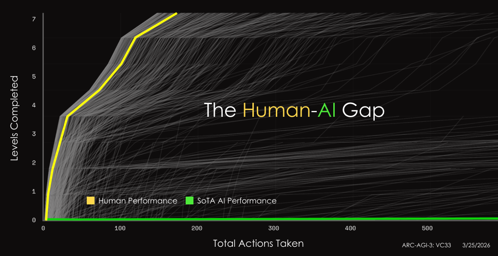
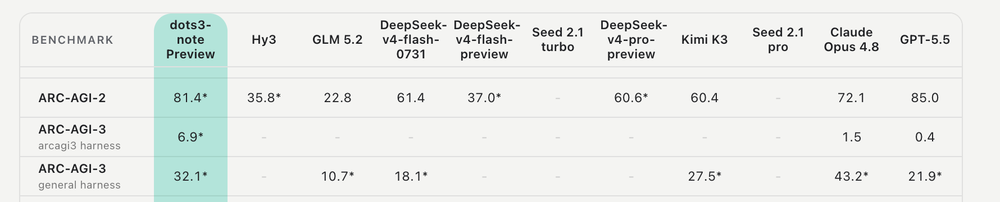

<h1 align="center">
Building a Pacman Game Agent with <em>AReaL</em>
</h1>

<p align="center"><em>From a vision-language model to a long-horizon game agent</em></p>

This post explores a practical question: how can we train a vision-language model (VLM)
to become an interactive agent that acts coherently over an entire game, rather than
answering a single static prompt? We study this question through Pacman.
[MaaPacman](https://codehub-dg-g.huawei.com/AgenticRLGaming/MaaPacman) provides the
controlled game environment and interaction adapters, while AReaL provides the rollout
and distributed reinforcement-learning infrastructure.

The model repeatedly observes the game, selects an action from the current state's
admissible-action set, and learns from consequences that unfold across a complete game
trajectory. Our goal is not simply to maximize a Pacman score, but to understand the
task definition, feedback design, and systems support needed to train long-horizon
visual agents reliably.

## 1. Motivation: Why Agentic RL Belongs in Games

[ARC Prize](https://arcprize.org/)'s ARC-AGI-3 replaces static puzzles with unfamiliar
mini-games whose rules are never explained: the agent must learn them by playing. Figure
1 is the whole argument for agentic RL in one picture. Humans clear seven levels in
roughly 170 actions, while the best AI agents stay flat on the floor no matter how many
actions they spend. What is missing is not knowledge or one-shot reasoning, but the
ability to stay coherent in a world that answers back.



*Figure 1. Levels completed versus total actions taken on ARC-AGI-3. Yellow is human
play; green is the best AI agent. Image credit: [ARC Prize](https://arcprize.org/).*

That gap is where the field has turned. Labs are no longer only scaling static datasets;
they are training agents inside game-like worlds.
[dots3-note Preview](https://studio.dots.ai/dots/dots3-en.html), the first open-weight
model of Xiaohongshu (Rednote) dots studio's dots3 family, was RL-trained across
thousands of novel interactive environments so that it explores, updates memory, and
adapts mid-task—and it leads the official ARC-AGI-3 harness with 6.9 out of 100 (Figure
2). Benchmarks, model releases, and training recipes are converging on the same shape of
problem: an agent, an environment that reacts, and a reward that only arrives many steps
later.



*Figure 2. Even the leading model scores 6.9 on the official ARC-AGI-3 harness, against
1.5 for Claude Opus 4.8 and 0.4 for GPT-5.5. Rows excerpted from dots studio's published
evaluation table; `*` marks their own in-house runs, and `-` marks unreported entries.*

We think it is time for AReaL to step into this domain. AReaL already supplies most of
the substrate—asynchronous rollout, PPO/GRPO, multimodal training—but its reference
examples exercise multi-turn interaction and image conditioning largely apart from each
other, and none of them keeps a live environment in the loop. A game agent needs both at
once, plus state-dependent action legality and credit assignment across hundreds of
steps. Games are the most controllable place to build that: explicit rules, measurable
outcomes, resettable episodes. This post is our first step in that direction rather than
a finished agentic-RL framework, and Pacman is the deliberately small instance we start
from—one maze is cheap to render and easy to inspect, yet clearing it still takes
hundreds of dependent decisions in which an early wrong turn decides the outcome.

## 2. Problem Definition

How can we train a vision-language model (VLM) to perceive, decide, and act in a
long-horizon game through a sequence of grounded decisions?

Unlike a static vision-language task, Pacman needs a closed interaction loop. Each model
output changes the environment. It determines the next observation and admissible-action
set. A game may contain hundreds of these linked decisions. Together, they determine the
outcome.

### 2.1 Two policy settings

We study two policy settings with different action abstractions: a **primitive-action
policy** and a **harness-mediated option policy**.

Stage I uses the primitive-action policy in a ghost-free environment. Stage II uses the
harness-mediated option policy with ghosts enabled. These stages describe the capability
curriculum. They are not Pacman's numbered levels. Stage I isolates visual maze
grounding and local navigation. Stage II adds dynamic hazards and higher-level
objectives.

The **global action vocabulary** `V` is a fixed set of action identifiers. Each
identifier is represented by one output token. At decision `t`, the **state-dependent
admissible-action set** `A(s_t) ⊆ V` contains the identifiers allowed by the environment
or deterministic option harness. Constrained decoding restricts sampling to `A(s_t)`.
The **policy support** is the set of actions with nonzero probability after the decoding
rule is applied. It is not another name for the admissible-action set.

Within each policy setting, `V` stays fixed. Only `A(s_t)` changes from one decision to
the next. For the primitive-action policy, `V` contains four direction identifiers. For
the harness-mediated option policy, `V` is a fixed, bounded vocabulary of high-level
option identifiers. In both cases, constrained decoding restricts sampling to the
current `A(s_t)`, not the full vocabulary.

| Setting                            | Model output                                             | Admissible-action set at one decision                       | Execution unit                                     | Stage in this study      |
| ---------------------------------- | -------------------------------------------------------- | ----------------------------------------------------------- | -------------------------------------------------- | ------------------------ |
| **Primitive-action policy**        | One primitive-action identifier                          | Identifiers for directions open in the current state        | One primitive environment step                     | Stage I · ghost-free     |
| **Harness-mediated option policy** | One identifier for a harness-generated high-level option | Identifiers for the options advertised in the current state | A bounded, revalidated sequence of primitive steps | Stage II · ghost-enabled |

With the primitive-action policy, one model decision controls one game step. Constrained
decoding removes directions that are blocked in the current state. The model still
chooses the next low-level move.

With the harness-mediated option policy, a deterministic option harness creates a small
set of high-level options. The options come from predefined strategy families: collect
pellets, avoid danger, or pursue an edible ghost. Only the strategy families are
predefined. The harness recomputes each option's target, route, and availability from
the current game state. We call each resulting choice a **harness-generated high-level
option**. Only identifiers for the currently advertised options enter `A(s_t)`.

After the model selects an advertised option, the harness executes its primitive moves.
After each step, the harness checks whether the option is complete or invalid. This
creates a temporal action abstraction. The model chooses Pacman's next high-level
objective instead of Pacman's next direction. Low-level route construction and safety
validation stay deterministic.

Across both settings, the task requires:

1. **Visual grounding:** extract task-relevant information from the current game screen.
1. **Closed-loop decision-making:** adapt each decision to the state produced by
   previous actions.
1. **State-dependent action admissibility:** select only an identifier in `A(s_t)`. In
   the harness-mediated option policy, both this admissible-action set and each
   advertised option's grounded target may change between decisions.
1. **Long-horizon decision-making:** account for consequences that may appear many
   decisions later.
1. **Generalization:** transfer the learned policy to unseen game states and maze
   layouts rather than memorize one trajectory.

## 3. Challenges

### 3.1 Sparse rewards alone cannot start learning without basic perception and planning

We first tested whether the base VLM could recover the game state from pixels. On three
frames from live demos, the model scored `0/3` on exact Pacman position, `0/3` on the
complete `OPEN` and `BLOCKED` direction sets, and `0/3` on producing a valid 25-by-21
ASCII maze. Its mean absolute error on the remaining-pellet count was 48. The model
recognized the scene as Pacman but could not recover the state needed for control.

This creates a cold-start problem for reinforcement learning. In an early image-only
test of the untrained model, none of 32 rollouts completed the maze. Every episode
reached the step limit and produced the same negative episode return. The returns did
not vary within a group. Group-relative normalization would therefore assign zero
advantage to every sample. It would provide no policy-gradient signal. A longer rollout
horizon cannot fix missing visual grounding or planning. It may only produce longer and
more expensive versions of the same uninformative trajectories.

The seed-0 replay below shows this failure in practice. The original, untrained
Qwen3.5-9B policy makes little useful progress. The episode eventually terminates as
`STUCK`. This behavior reflects weak visual grounding and planning.

<div align="center">
  <video src="https://github.com/user-attachments/assets/2745b846-65d1-47a2-be22-8b79ee217ca1" controls preload="metadata" playsinline width="72%" poster="../assets/demos/pacman-base-seed0-poster.png"></video>
  <br>
  <a href="../assets/demos/pacman-base-seed0.mp4">Download MP4</a>
</div>

This cold-start barrier motivates a curriculum. We introduce visual grounding, local
action selection, and longer-horizon planning in stages. This lets the initial policy
learn these skills before it attempts the full game.

### 3.2 Long feedback cycles and GPU memory requirements

One run had 49 optimizer updates. Each update used 48 rollout episodes. From the first
rollout of Iter1 to the last rollout of Iter49, the run took 46.21 hours end to end.
This time includes the optimizer updates between rollout batches.

A subtle bug in the architecture or experiment design may not appear in the learning
curve for many hours. By then, the run may have used substantial compute.

These experiments also need substantial GPU memory. The vLLM rollout engine, FSDP actor,
and optional reference model share compute and memory on the same 8-GPU node. Long
rollout episodes need more trajectory storage. They also increase the cost of
log-probability computation. We therefore treat model offloading, memory-aware batching,
distributed trajectory processing, and checkpoint retention as required parts of the
training design.

### 3.3 Rollout and training must use the same recorded action mask and temperature

Constrained decoding keeps each sampled output inside the current state-dependent
admissible-action set. A rollout can still produce a wrong PPO update even when every
executed action is admissible. This happens when rollout and training use different
admissible-action sets or temperatures to score the chosen action.

PPO may treat this scoring mismatch as a policy change. Valid samples may then be
clipped or rejected. Training may also send gradients into inadmissible-action logits.
These failures can occur even when every executed action is admissible and the loss is
finite. Section 4.3 shows how we keep rollout and training probabilities aligned.

### 3.4 Feedback timescale and episode weight are separate choices

Long-horizon learning has two separate design choices. Feedback timescale determines
what signal each decision receives. Episode weighting determines how much total
optimization weight each episode receives.

Episode-level feedback aligns learning with the whole-game outcome. It gives every
decision in the episode the same coarse task signal. Step- or option-level feedback is
more precise in time, but it may miss consequences that appear later. These feedback
timescales are complementary, not interchangeable.

Episode weighting is a separate issue. A flat mean over trained tokens gives longer
trajectories more influence because they contain more model decisions. The objective
should preserve the intended feedback timescale. It should not let episode length
determine episode weight. Section 4.5 shows how we handle both choices in the objective.

## 4. Method

### 4.1 System architecture: MaaPacman as the RL environment adapter

Figure 3 shows the flow from left to right. MaaPacman sits between the RL workflow and
each Pacman game instance. It exposes a Gym-style API to the workflow. `reset(seed)`
starts an episode. `step(action)` returns the next RGB observation, base reward,
termination and truncation flags, and structured game metadata. `render()` returns the
current frame. Each environment object manages one isolated `pacman-python` game
instance. The workflow does not need to handle game-process details.


*Figure 3. Each MaaPacman environment object gives the RL workflow a Gym-style
interface. It sends actions to one isolated Pacman game instance. The rollout policy
selects actions. The FSDP actor learns from grouped trajectories but does not control
the game.*

During rollout, the workflow sends the RGB observation and current admissible-action set
to the policy. For the option policy, it also sends metadata for each available option.
The policy returns an action identifier. The environment or option harness maps that
identifier to a primitive action or grounded option. In Figure 3, “legal option support”
means the state-dependent admissible-action set `A(s_t)`, not policy support. After the
action, the environment returns game events and terminal state. The `areal-pacman`
workflow applies the experiment reward and groups the interaction records into
trajectories. AReaL trains on those trajectories and sends updated weights back to the
rollout policy.

The four repositories divide the work as follows:

| Repository      | Responsibility                                                                                                                                    | Deliberate boundary                                       |
| --------------- | ------------------------------------------------------------------------------------------------------------------------------------------------- | --------------------------------------------------------- |
| `pacman-python` | Concrete game instances: Pygame transitions, RGB frames, structured state, and terminal events                                                    | Game semantics only; no RL interface                      |
| `MaaPacman`     | Gym-style headless adapter, isolated game workers, and deterministic option harness                                                               | Environment interaction and planning; no distributed RL   |
| `areal-pacman`  | Environment-to-AReaL workflow, prompts, reward function, configuration, evaluation, and experiment records                                        | Experiment semantics; no generic FSDP/vLLM implementation |
| `AReaL`         | Asynchronous rollout, PPO/GRPO, vLLM, FSDP, checkpointing, distributed data movement, and our training-side constrained-log-probability extension | No game-environment or option-generation logic            |

This split lets us test game events, rewards, and distributed policy updates separately.
It also makes the control flow clear. The rollout policy acts in the game. The training
actor only updates weights.

### 4.2 Harness-mediated option policy: let the model choose intent

With the harness-mediated option policy, the model chooses a high-level goal instead of
one movement direction. At each decision, the deterministic harness creates a bounded
set of options that are valid in the current state. The options come from three fixed
strategy families:

- **Collect pellets:** move toward an approved pellet target;
- **Avoid danger:** move toward a safe escape anchor;
- **Pursue an edible ghost:** approach a vulnerable ghost.

Each option has a target, a first primitive action, a step limit, and safety metadata.
The VLM chooses one option identifier from the current admissible-action set. It does
not output a fixed action list. The harness uses breadth-first search (BFS) and
handcrafted safety checks to turn the option into primitive moves. `COLLECT`, `AVOID`,
and `ELIMINATE` have step caps of `min(8, d)`, `min(3, d)`, and `min(6, d)`. Here, `d`
is the current shortest-path distance. After every environment step, the harness
recomputes and checks the strategy and target. It stops when the option finishes,
becomes invalid, reaches its cap, or the episode ends or is truncated. It never blindly
replays a fixed route.

In our runs, one model-selected option covered **1.49 primitive environment steps** on
average. Primitive-action control covered one step per model decision. The harness
therefore reduced the number of model calls. The reduction was modest because most
`COLLECT` options targeted a nearby pellet and stopped after one step.

The harness checks legality, builds routes, and enforces safety rules. The learned
policy chooses which available high-level option best fits the current visual state.
This reduces model calls without hard-coding the full Pacman policy.

### 4.3 Constraint alignment across rollout and training

At decision `t`, let `A_t = A(s_t) ⊆ V` be the recorded state-dependent
admissible-action set. Constrained decoding renormalizes the rollout policy over `A_t`
at temperature `T`. [AReaL's decoupled PPO objective](https://arxiv.org/abs/2505.24298)
tracks three policies. `π_behav` is the vLLM rollout policy. `π_prox` is the actor
before the update. `π_θ` is the current actor. AReaL then applies the
[clipped PPO update](https://arxiv.org/abs/1707.06347). The behavior-correction ratio
compares how rollout and training score the recorded action:

```math
w_t = \frac{\pi_{\mathrm{prox}}(a_t \mid s_t,A_t;T)}
           {\pi_{\mathrm{behav}}(a_t \mid s_t,A_t;T)}.
```

When `π_behav` and `π_prox` have the same parameters and use the same `A_t` and `T`,
`w_t = 1`. If rollout and training use different admissible-action sets or temperatures,
`w_t` can differ from one even when the model parameters match. This mismatch is a
normalization error, not policy staleness. It creates false importance weights. It can
reject or clip valid samples and send gradients into inadmissible logits.

[Huang and Ontañón](https://arxiv.org/abs/2006.14171) study a similar mismatch. Their
agent samples actions from a masked distribution but computes policy-gradient updates
from the unmasked distribution. They call this **naive invalid action masking**. In
their PPO experiments, this mismatch caused higher KL divergence and less stable
convergence than consistent masking.

At rollout time, the workflow maps the identifiers in `A_t` to exact tokenizer IDs. A
small AReaL request adapter forwards them to vLLM's built-in `allowed_token_ids`, which
masks other tokens before sampling. The rollout stores the sampled token, temperature,
constrained behavior log-probability `log π_behav`, and exact `A_t` in the same record.
This keeps them aligned during distributed batching.

Before an update, the FSDP actor recomputes `log π_prox`. During the PPO forward pass,
it computes `log π_θ`. These operations score the recorded action. They do not generate
a new action. Both normalize the actor logits over the recorded `A_t`. When KL
regularization is enabled, `π_ref` uses the same set and temperature. `π_ref` is not a
denominator in the PPO ratio. The policies may assign different probabilities because
their parameters or versions differ. However, they must use the same admissible-action
set and normalization rule.

Masking actions only during rollout is not enough. Every log-probability must use the
recorded admissible-action set and temperature. This rule applies to the rollout
behavior policy, proximal actor, current actor, and optional reference policy.

### 4.4 Reward design: learn from events, not raw score

The Stage I primitive-action configurations derived rewards from structured game events
emitted by the environment rather than the game's raw score. In the 256-step
configuration, a valid executed action at step $t$ received:

```math
\begin{aligned}
r_t ={}& n_t^{\text{pellet}}
+ n_t^{\text{power}}
+ 50\,\mathbb{1}[\text{level cleared}] \\
&- 0.05
- 0.5\,\mathbb{1}[\text{wall collision}]
+ r_t^{\text{progress}}.
\end{aligned}
```

Fruit remains observable but carries no direct training reward. To provide denser
feedback, we add a progress term based on the change in shortest-path distance to the
nearest normal pellet:

```math
r_t^{\text{progress}}
= 0.1\,c_t\,(d_{t}^{\text{before}}-d_{t}^{\text{after}}),
\qquad
c_t = 1-\rho_t,
\qquad
\rho_t=\frac{m_t}{m_0}.
```

Here, $m_t$ is the number of normal pellets remaining after step $t$, and $m_0$ is the
initial count. If a step already collects a normal pellet, we omit the progress term.
This avoids rewarding the same event twice. The factor $c_t$ makes the progress reward
strongest late in the game, when few pellets remain. An invalid or unparsable response
gives that model decision `-50` and ends the episode.

Stage I-B kept the same event rewards and fixed step cost. It used raw feedback for each
decision, with no reward or advantage normalization. Stage I-B remained ghost-free.
Ghost, death, and safety-refusal rewards appear only in the ghost-enabled
configurations.

This shaped reward is a training signal, not the success criterion. Strict level
completion and held-out success remain the primary evaluation metrics.

### 4.5 From environment rewards to the policy objective

The reward function defines the feedback from the environment. The objective contract
defines how training assigns, normalizes, and reduces that feedback. We describe the
objective contract along three dimensions: feedback timescale, normalization, and
episode weighting.

**Feedback timescale.** A decision can receive the reward from its next environment
step. A high-level option can instead receive the sum of rewards over its committed
execution span:

```math
R^{\text{option}}_{e,j}
= \sum_{t\in\text{committed span}(e,j)} r_{e,t}.
```

Both signals are temporally local. They do not assign credit for events after the scored
step or option. An option-span return is still a local return. It is not a
counterfactual or state-conditioned advantage. For an episode-level signal, we instead
sum all shaped step rewards in one rollout episode:

```math
R_e=\sum_t r_{e,t}.
```

This signal preserves the whole-episode objective. Every model decision in the episode
receives the same coarse task signal.

**Normalization.** A local or episode-level signal may be used raw or normalized. In the
episode-level group-relative contract, returns sampled from the same initial prompt are
normalized with the group sample standard deviation:

```math
G_e=\frac{R_e-\mu_{\text{prompt}}}
{\sigma_{\text{prompt}}+10^{-5}}.
```

Normalizing a local signal changes its scale or comparison group. It does not change the
feedback timescale. Episode aggregation preserves each reward's contribution to the
total but discards when it occurred.

**Episode weighting.** Loss is averaged within each rollout episode before episodes are
averaged:

```math
L=\frac{1}{|E|}\sum_{e\in E}
\left(\frac{1}{N_e}\sum_{t\in e}L_{e,t}\right).
```

Here, $N_e$ is the number of valid trained action tokens in rollout episode $e$. This
prevents a long episode from receiving more weight only because it has more trained
tokens. For example, the token losses from a 200-decision episode and a 50-decision
episode are averaged within their own episodes. The data pipeline keeps episode
boundaries and encoded admissible-action sets. It also balances token load across
workers.

### 4.6 What AReaL provides, and what Pacman required

[AReaL](https://github.com/inclusionAI/AReaL) provides asynchronous rollout, PPO/GRPO,
distributed inference and training, checkpointing, multi-turn workflows, and multimodal
support. Its reference examples show multi-turn interaction and image input separately.
The GSM8K retry loop is text-only. `VisionRLVRWorkflow` uses one image-conditioned
generation per episode.

MaaPacman combines multi-turn interaction with image input. Before each model decision,
it renders the current game state and adds one fresh PNG to the prompt. AReaL keeps the
matching VLM processor outputs through rollout and training. One selected option may
then run for several primitive environment steps before the next model call. The model
therefore receives one fresh image per decision, not per environment step.

The integration passes each state's admissible-action set from rollout to the actor and
reference-policy log-probability calculations. This keeps the constrained policy
definition the same during generation and training. It also preserves episode identity
during distributed batching. This lets episodes receive equal loss weight even when
their trajectories have different lengths. The integration also supports long episodes,
variable-length options, VLM memory use, checkpoint retention, and reproducible
experiment records.

Together, these changes let our AReaL-based stack train a Pacman agent with
state-dependent admissible actions. The current interface is still specific to Pacman.
It is not yet a general API for constrained agents.

## 5. Experimental Results

### Experimental overview

We used a staged curriculum instead of training the full ghost-aware task from scratch.
Stage I learned ghost-free primitive-action navigation in two phases. Stage I-A used a
256-step cap and selected Iter16. Stage I-B started from Iter16, raised the cap to 512
steps, and tested maze generalization. Stage II enabled ghosts and switched to a
harness-mediated option policy. It also tested the whole-episode training path.

#### Stage setup

| Phase                   | Environment   | Action interface        | Initialization                | Rollout cap |
| ----------------------- | ------------- | ----------------------- | ----------------------------- | ----------: |
| **Stage I-A**           | Ghost-free    | One primitive direction | Base Qwen3.5-9B               |         256 |
| **Stage I-B**           | Ghost-free    | One primitive direction | Continue from Iter16          |         512 |
| **Stage II probe**      | Ghost-enabled | Harness-mediated option | Base Qwen3.5-9B and Iter25    |         512 |
| **Stage II validation** | Ghost-enabled | Harness-mediated option | Iter25 actor and KL reference |         512 |

Training rollouts used `temperature=0.7`. Evaluations used greedy decoding.

#### What each stage tests

| Phase                   | Training signal                                         | Main result                        | What it shows               |
| ----------------------- | ------------------------------------------------------- | ---------------------------------- | --------------------------- |
| **Stage I-A**           | Local feedback for each decision; no episode-level GRPO | Iter16 selected over Iter49        | Checkpoint selection        |
| **Stage I-B**           | Local feedback for each decision; no episode-level GRPO | Iter25/31; 44/50 held-out mazes    | Ghost-free maze transfer    |
| **Stage II probe**      | No training                                             | Iter25 `8/12` vs. base `2/12`      | Early transfer signal       |
| **Stage II validation** | Episode-level group-relative objective (GRPO)           | Three updates completed end to end | The full training loop runs |

Both Stage I phases trained each decision from temporally local feedback. Stage II
validation instead used one group-relative signal for the whole episode. Here, “local”
refers to the **credit-assignment timescale**. It does not describe the observation. The
model still receives the current maze image at every decision.

### 5.1 Stage I: Ghost-free primitive-action navigation

In both Stage I phases, the model reads the current maze image and chooses one
admissible primitive direction. Stage I-B starts from Iter16 and uses a longer rollout
cap. It also changes reward processing. The two phases are one staged lineage, not a
controlled causal comparison.

#### Stage I-A: 256-step bootstrapping and checkpoint selection

Stage I-A used Qwen3.5-9B and a 256-step rollout cap. Each action was one
primitive-direction token. The action had to match a direction that was open in the
current state. Training used local feedback for each decision. It did not use the
whole-episode signal or equal-episode loss weighting from Section 4.5.

Each update sampled 48 episodes at temperature 0.7 on one 8-GPU node. We used four
prompt rows and collected 12 episodes from each row. For every completed update, all 48
episodes reached the 256-step cap. Training rollouts alone could not show which
checkpoints could finish the maze. We therefore used terminal evaluation after 49
optimizer updates. It selected Iter16 instead of the latest checkpoint.

| Checkpoint      | Mean shaped reward in its rollout batch | Greedy wins on seeds 0, 1, 2 | Mean normal-pellet clear rate |
| --------------- | --------------------------------------: | ---------------------------: | ----------------------------: |
| Base Qwen3.5-9B |                                       — |                          0/3 |                          1.6% |
| Iter16          |                               **150.7** |                      **3/3** |                    **100.0%** |
| Iter49          |                                   120.3 |                          0/3 |                         92.2% |

We used these three deterministic runs on one maze only to choose a checkpoint. They are
too few to estimate a general success rate. Iter49 still cleared 92.2% of pellets on
average, but it won 0/3 runs. It looked strong on local proxy metrics but did not finish
the maze. Checkpoint selection must therefore use terminal wins, not training reward or
pellet-clear percentage alone.

The 256-step cap applied only to training rollouts. Each training episode stopped after
256 environment steps. This limited training coverage of late-game states. Evaluation
did not apply this training-specific cap. One successful Iter16 evaluation continued for
666 environment steps before it cleared the maze. The cap therefore limited training
coverage, not evaluation-time execution.

Section 3.1 shows the base-model failure. The matched replays below show why we selected
Iter16 instead of Iter49.

<table>
  <tr>
    <th width="50%">Iter16 · selected checkpoint</th>
    <th width="50%">Iter49 · later checkpoint</th>
  </tr>
  <tr>
    <td valign="top">
      <video src="https://github.com/user-attachments/assets/15a7c273-3133-4650-9cb1-4be81323fb00" controls preload="metadata" playsinline width="100%" poster="../assets/demos/pacman-iter16-seed0-poster.png"></video>
    </td>
    <td valign="top">
      <video src="https://github.com/user-attachments/assets/1160f967-c7bb-4426-b5e2-1834b3138018" controls preload="metadata" playsinline width="100%" poster="../assets/demos/pacman-iter49-seed0-poster.png"></video>
    </td>
  </tr>
  <tr>
    <td align="center"><em>Seed 0: clears the maze.</em></td>
    <td align="center"><em>Seed 0: clears most pellets but terminates STUCK.</em></td>
  </tr>
  <tr>
    <td align="center"><a href="../assets/demos/pacman-iter16-seed0.mp4">Download Iter16 MP4</a></td>
    <td align="center"><a href="../assets/demos/pacman-iter49-seed0.mp4">Download Iter49 MP4</a></td>
  </tr>
</table>

*On the original ghost-free benchmark maze, Iter16 clears the level while Iter49 gets
stuck, showing that near-complete pellet clearance does not guarantee terminal success.*

#### Stage I-B: 512-step continuation and learning dynamics

Stage I-B started from the selected Iter16 checkpoint. It raised the rollout cap to 512
steps. It used **raw feedback for each decision, with no reward or advantage
normalization**. It produced Iter25 and Iter31.

Each point in Figure 4 summarizes 48 stochastic training rollout episodes from one
optimizer update. The points are not greedy evaluation results. The top panel's “Mean
shaped reward” is the mean logged episode return for that batch. It is not reward per
step. Normal-pellet clear rate is the mean fraction of starting pellets collected by the
end of an episode. Win rate is the fraction of episodes that clear the maze. A shorter
episode can mean an earlier win or an earlier failure, so read episode length together
with the cap, win rate, and terminal reason.


*Figure 4. Training rollout dynamics for the selected lineage. Blue shows Stage I-A
through Iter16 with a 256-step cap. Green shows Stage I-B, which started from Iter16 and
used a 512-step cap. The separate Stage I-A run to Iter49 is not shown. Clear and win
rates can be compared across phases. Shaped returns cannot be compared because the
reward and normalization contracts change at the branch.*

#### Held-out-maze generalization

We evaluated Iter25, Iter31, and the base model on the same 50 held-out maze layouts. We
used deterministic greedy decoding and a 2,000-step limit.


*Figure 5. Iter25 increased strict passes from 0/50 to 44/50. Iter31 also passed 44/50
mazes.*

| Model           | Strict passes |   Wilson 95% CI | Mean normal pellets remaining |  Easy / medium / hard |
| --------------- | ------------: | --------------: | ----------------------------: | --------------------: |
| Base Qwen3.5-9B |          0/50 |       0.0%–7.1% |                        237.20 |    0/17 · 0/17 · 0/16 |
| Iter25          |     **44/50** | **76.2%–94.4%** |                          0.30 | 17/17 · 17/17 · 10/16 |
| Iter31          |     **44/50** | **76.2%–94.4%** |                      **0.24** | 17/17 · 17/17 · 10/16 |

Iter25 achieved an 88% pass rate (44/50), up from 0/50 for the base model. Iter31 also
passed 44/50 mazes. Both checkpoints failed the same six hardest maze variants.

This was a safe-mode test of navigation across maze layouts. Ghosts and fruit were
disabled. The 44/50 result shows transfer across maze geometry in this setting. It does
not test general ghost-aware Pacman play.

The three videos below use the frozen Iter31 checkpoint on three maze layouts. All three
use seed 0, greedy decoding, open-action masking, and a 2,000-step limit.

<table>
  <tr>
    <th width="33%">Original maze</th>
    <th width="33%">Held-out maze A</th>
    <th width="33%">Held-out maze B</th>
  </tr>
  <tr>
    <td valign="top">
      <video src="https://github.com/user-attachments/assets/912ae066-187a-4e7f-ae40-e42a0d396255" controls preload="metadata" playsinline width="100%" poster="../assets/demos/pacman-iter31-level1-original-poster.png"></video>
    </td>
    <td valign="top">
      <video src="https://github.com/user-attachments/assets/f17cbe9e-599f-400a-a533-5945dba0fc61" controls preload="metadata" playsinline width="100%" poster="../assets/demos/pacman-iter31-level5-held-out-poster.png"></video>
    </td>
    <td valign="top">
      <video src="https://github.com/user-attachments/assets/9c2c173b-05c9-4b93-984c-fdea1c008f2c" controls preload="metadata" playsinline width="100%" poster="../assets/demos/pacman-iter31-held-out-maze-poster.png"></video>
    </td>
  </tr>
  <tr>
    <td align="center">413 steps · reward 1,907<br>score 2,320 · <strong>strict pass</strong></td>
    <td align="center">446 steps · reward 1,924<br>score 2,370 · <strong>strict pass</strong></td>
    <td align="center">841 steps · reward 2,799<br>score 3,640 · <strong>strict pass</strong></td>
  </tr>
  <tr>
    <td align="center"><a href="../assets/demos/pacman-iter31-level1-original.mp4">Download MP4</a></td>
    <td align="center"><a href="../assets/demos/pacman-iter31-level5-held-out.mp4">Download MP4</a></td>
    <td align="center"><a href="../assets/demos/pacman-iter31-held-out-maze.mp4">Download MP4</a></td>
  </tr>
</table>

*All three runs clear every normal pellet. Ghosts and fruit are disabled, so the videos
show maze navigation and pellet collection, not ghost-aware play.*

### 5.2 Stage II: Ghost-enabled, harness-mediated option policy

Stage II enables ghosts and changes the decision interface. The model no longer chooses
every primitive direction. It chooses high-level options to collect pellets, avoid
danger, or pursue an edible ghost.

#### Transfer before further training

We first tested Iter25 with this policy before any new PPO update. At seed 2 and
temperature 0.7, Iter25 and the base model each ran 12 episodes with a 512-step cap.
Iter25 completed the normal-pellet objective in `8/12` episodes, compared with `2/12`
for the base Qwen3.5-9B model. Each model produced 12 distinct option paths across its
12 episodes.

#### Three-update training check

To test the full Stage II training loop, we initialized the actor and frozen KL
reference from the same fixed Iter25 checkpoint and started a fresh optimizer. We ran
three updates. Each update used four initial prompts and 12 episodes per prompt, for 48
episodes with a 512-step cap. For each episode, we summed the collected rewards and
normalized the return only within its prompt group. We assigned that signal to the
episode's option decisions and gave every episode equal intended loss weight. All three
updates finished and produced model checkpoints.

#### Exploratory comparison after training

After training, we started an in-sample evaluation on the original Stage II prompts. The
run stopped before all four policy versions reached the planned 144 episodes. We
therefore compared only the 60 episode IDs available for the control and all three
updated checkpoints. This kept the comparison paired.

| Policy version     | Normal-pellet completions | Change vs. control | Mean normal pellets remaining | Mean score | Steps per model turn | Exact McNemar `p` vs. control |
| ------------------ | ------------------------: | -----------------: | ----------------------------: | ---------: | -------------------: | ----------------------------: |
| Pre-update control |             21/60 (35.0%) |                  — |                          73.1 |      9,231 |                 1.47 |                             — |
| Update 1           |             22/60 (36.7%) |            +1.7 pp |                          63.6 |     10,046 |                 1.51 |                         1.000 |
| Update 2           |             26/60 (43.3%) |            +8.3 pp |                          46.4 |     11,169 |                 1.50 |                         0.359 |
| Update 3           |             23/60 (38.3%) |            +3.3 pp |                          49.1 |     11,114 |                 1.50 |                         0.839 |

Update 2 had the highest observed completion rate. Its paired difference from the
control was not statistically significant. The run was incomplete and reused training
prompts. We therefore treat this result as exploratory, not as held-out evidence.

#### One matched replay

The two videos below use the same training prompt and sampling slot: seed 12, sample 00.
The Iter25 control stopped with a safety refusal after 54 environment steps, with 152
normal pellets left. Update 2 cleared all normal pellets in 352 steps.

<table>
  <tr>
    <th width="50%">Pre-update Iter25 control</th>
    <th width="50%">After optimizer update 2</th>
  </tr>
  <tr>
    <td valign="top">
      <video src="https://github.com/user-attachments/assets/0d061873-7fea-4fdf-850d-69ca9d795c8d" controls preload="metadata" playsinline width="100%" poster="../assets/demos/pacman-stage2-control-seed12-sample00-poster.png"></video>
    </td>
    <td valign="top">
      <video src="https://github.com/user-attachments/assets/81ef8afc-2a14-407c-92e4-b1e0f44743e2" controls preload="metadata" playsinline width="100%" poster="../assets/demos/pacman-stage2-update2-seed12-sample00-poster.png"></video>
    </td>
  </tr>
  <tr>
    <td align="center">54 environment steps · safety refusal<br>152 normal pellets remaining</td>
    <td align="center">352 environment steps<br><strong>All normal pellets cleared</strong></td>
  </tr>
  <tr>
    <td align="center"><a href="../assets/demos/pacman-stage2-control-seed12-sample00.mp4">Download control MP4</a></td>
    <td align="center"><a href="../assets/demos/pacman-stage2-update2-seed12-sample00.mp4">Download Update 2 MP4</a></td>
  </tr>
</table>

This pair shows one behavior change on a training prompt. It does not estimate the
overall win-rate change or test held-out transfer or reliable ghost avoidance.

#### What Stage II shows

Before further training, Iter25 used the ghost-enabled option policy and produced 12/12
distinct option paths. The three-update run showed that the whole-episode
constrained-policy training loop works end to end. In the incomplete paired comparison,
Update 2 had the highest observed completion rate, but its difference from the control
was not statistically significant. The matched videos show one concrete behavior change.

Together, these results confirm the training path and give an early transfer signal, but
they do not show a robust ghost-aware agent. That claim needs a longer learning curve,
multiple seeds, and held-out evaluation. Clearing normal pellets is also only one
possible full-game objective.

## 6. Insights

### 6.1 Latest is not always best

Iter16 beat Iter49 in terminal evaluation. Iter49 still had a high shaped reward and
92.2% mean pellet clearance. Keep periodic checkpoints and use a fixed
terminal-evaluation suite to choose the best one. The latest checkpoint is not always
the best.

We do not know why Iter49 regressed. Limited late-game coverage and weak late-episode
credit are possible explanations. This run does not show that training converged to a
local optimum.

### 6.2 Reward processing changes what the policy learns

How we process rewards defines what the policy learns. Normalizing a local reward does
not turn it into episode-level feedback. An episode return aligns learning with the
whole-game outcome, but gives coarser temporal credit. Averaging by episode also stops
longer trajectories from getting extra weight simply because they contain more trained
tokens.

These runs do not compare those choices in isolation. Stage I-A and Stage I-B also
differ in initialization and rollout horizon. Stage II changes the environment and
action interface as well. A fair comparison needs a matched ablation.

### 6.3 Proxy metrics are not the task

Pellet clearance, shaped reward, score, and action diversity help explain behavior. They
do not define success. Iter49 averaged 92.2% pellet clearance but won 0/3 games. Start
the evaluation with terminal wins and failure reasons.

### 6.4 Safe-mode transfer is not general Pacman play

The 44/50 result shows transfer across maze layouts in safe mode. It does not show
general Pacman play. Turning on ghosts changes the dynamics, rewards, and failure modes.
With the option policy, it also changes which options are available.

## 7. Conclusion

Pacman is small, but it exposes the hard parts of long-horizon visual-agent RL:
closed-loop perception, state-dependent admissible-action sets, credit assignment,
rollout-training alignment, and distributed execution. MaaPacman provides a controlled,
resettable game interface and a deterministic option harness. AReaL provides
asynchronous rollouts and distributed multimodal training. Together, they form an
end-to-end testbed for learning through extended visual interaction.

In ghost-free safe mode, Iter25 and Iter31 each achieved 44/50 strict passes on held-out
mazes; the base Qwen3.5-9B achieved 0/50. Stage II then verified that the ghost-enabled,
constrained, episode-level GRPO pipeline runs end to end and provided an early transfer
signal. The available evidence does not yet establish robust ghost-aware play.

The optimizer is only one part of agentic RL. The action interface, rollout-training
alignment, and reward-to-objective contract shape the optimization signal. Terminal
evaluation is therefore essential for checkpoint selection and for distinguishing task
success from proxy progress.

Next, we will run controlled ghost-aware evaluations across multiple seeds and matched
reward-processing ablations. Longer term, we want the agent and its option harness to
co-evolve by learning option generation and selection together, while keeping action
legality and safety checks deterministic.
